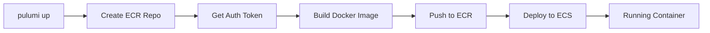

# ECR and Docker Provider Integration

This document summarizes the ECR and automated Docker build integration added to the Pulumi infrastructure.

## Overview

The Pulumi infrastructure now includes **fully automated Docker builds**. When you run `pulumi up`, Pulumi will:

1. Create an ECR (Elastic Container Registry) repository
2. Build your Docker image from the Dockerfile
3. Push the image to ECR
4. Deploy the image to ECS Fargate

**No manual Docker commands required!**

## What Was Added

### 1. Docker Provider Dependency

**File**: `pulumi/package.json`

```json
{
  "dependencies": {
    "@pulumi/docker": "^4.0.0"  // Added Docker provider
  }
}
```

### 2. ECR Repository Resource

**File**: `pulumi/index.ts` (lines 19-53)

```typescript
import * as docker from "@pulumi/docker";

// ECR Repository
const ecrRepository = new aws.ecr.Repository(`${appName}-backend`, {
    name: `${appName}-backend`,
    imageTagMutability: "MUTABLE",
    imageScanningConfiguration: {
        scanOnPush: true, // Automatic vulnerability scanning
    },
    encryptionConfigurations: [{
        encryptionType: "AES256", // Server-side encryption
    }],
    forceDelete: true,
    tags: tags,
});

// Lifecycle Policy (keep last 10 images)
const lifecyclePolicy = new aws.ecr.LifecyclePolicy(`${appName}-lifecycle`, {
    repository: ecrRepository.name,
    policy: JSON.stringify({
        rules: [{
            rulePriority: 1,
            description: "Keep last 10 images",
            selection: {
                tagStatus: "any",
                countType: "imageCountMoreThan",
                countNumber: 10,
            },
            action: {
                type: "expire",
            },
        }],
    }),
});
```

**Features**:
- ✅ **Vulnerability Scanning**: Automatic on every push
- ✅ **Encryption**: AES256 at rest
- ✅ **Lifecycle Management**: Keeps last 10 images, deletes older ones
- ✅ **Force Delete**: Can be destroyed even with images (use cautiously)

### 3. Automated Docker Build

**File**: `pulumi/index.ts` (lines 55-76)

```typescript
// Get ECR authentication token
const authToken = aws.ecr.getAuthorizationTokenOutput({
    registryId: ecrRepository.registryId,
});

// Build and push Docker image
const image = new docker.Image(`${appName}-image`, {
    imageName: pulumi.interpolate`${ecrRepository.repositoryUrl}:${environment}`,
    build: {
        context: "../", // Project root
        dockerfile: "../Dockerfile",
        platform: "linux/amd64", // x86_64 architecture
        args: {
            NODE_ENV: "production",
        },
    },
    registry: {
        server: ecrRepository.repositoryUrl,
        username: authToken.userName,
        password: authToken.password,
    },
}, { dependsOn: [ecrRepository] });
```

**Features**:
- ✅ **Automatic Authentication**: Uses ECR auth token
- ✅ **Build Context**: Entire project (../)
- ✅ **Platform Targeting**: linux/amd64 for Fargate
- ✅ **Build Args**: NODE_ENV=production
- ✅ **Image Tagging**: Stack name (dev, staging, prod)

### 4. ECS Integration

**File**: `pulumi/index.ts` (lines 383-390)

```typescript
containerDefinitions: pulumi.all([
    logGroup.name,
    openSearchDomain.endpoint,
    secretsManagerSecret.arn,
    image.repoDigest,  // Added: Use built image
]).apply(([logGroupName, opensearchEndpoint, secretArn, imageDigest]) => JSON.stringify([{
    name: "backend",
    image: imageDigest, // Automatic reference to built image
    // ...
}]))
```

**Changed**: Previously used `config.get("backendImage")`, now uses automatically built `image.repoDigest`.

### 5. New Outputs

**File**: `pulumi/index.ts` (lines 537-557)

```typescript
// Container Registry outputs
export const ecrRepositoryUrl = ecrRepository.repositoryUrl;
export const ecrRepositoryName = ecrRepository.name;
export const containerImageDigest = image.repoDigest;

// Useful commands
export const ecrLoginCommand = pulumi.interpolate`aws ecr get-login-password --region ${aws.getRegionOutput().name} | docker login --username AWS --password-stdin ${ecrRepository.repositoryUrl}`;
export const dockerBuildCommand = pulumi.interpolate`docker build -t ${ecrRepository.repositoryUrl}:latest ../ && docker push ${ecrRepository.repositoryUrl}:latest`;
```

**New Outputs**:
- `ecrRepositoryUrl`: ECR repository URL
- `ecrRepositoryName`: Repository name
- `containerImageDigest`: Unique digest of built image
- `ecrLoginCommand`: Command to login to ECR manually
- `dockerBuildCommand`: Command to build/push manually

### 6. Documentation

**New Files**:
- `pulumi/AUTOMATED_BUILD.md` - Comprehensive guide to automated builds
- `pulumi/ECR_DOCKER_INTEGRATION.md` - This file

**Updated Files**:
- `pulumi/README.md` - Updated deployment steps
- `CLAUDE.md` - Updated with automated build information

## How It Works

### Build Process



### Resource Dependencies

```
ecrRepository
    └─> lifecyclePolicy (depends on repository)
    └─> authToken (depends on repository)
        └─> image (depends on auth + repository)
            └─> taskDefinition (depends on image)
                └─> service (depends on task)
```

## Usage

### First Deployment

```bash
cd pulumi
npm install

pulumi stack init dev
pulumi config set aws:region us-east-1
pulumi config set --secret opensearchMasterPassword "SecurePass123!"

# This builds and deploys everything
pulumi up
```

**What happens**:
1. ECR repository created (~5 seconds)
2. Docker image built (~2-5 minutes)
3. Image pushed to ECR (~1-2 minutes)
4. Infrastructure created (~10-15 minutes)

**Total time**: ~15-20 minutes

### Updating Code

```bash
# Make code changes
# Then just run:
pulumi up
```

Pulumi will:
- Detect code changes
- Rebuild Docker image (cached layers = faster)
- Push new image
- Update ECS service

**Update time**: ~3-5 minutes (Docker build is cached)

### Manual Build (Optional)

If you prefer manual control:

```bash
# Login to ECR
pulumi stack output ecrLoginCommand | bash

# Build and push
pulumi stack output dockerBuildCommand | bash

# Force ECS deployment
aws ecs update-service \
  --cluster $(pulumi stack output ecsClusterName) \
  --service otel-ai-chatbot-service \
  --force-new-deployment
```

## Benefits

### Before (Manual)

```bash
# Manual workflow (multiple steps)
aws ecr create-repository --repository-name backend
aws ecr get-login-password | docker login ...
docker build -t backend .
docker tag backend:latest 123.dkr.ecr.us-east-1.amazonaws.com/backend:latest
docker push 123.dkr.ecr.us-east-1.amazonaws.com/backend:latest
pulumi config set backendImage 123.dkr.ecr.us-east-1.amazonaws.com/backend:latest
pulumi up
```

**Problems**:
- 7+ manual commands
- Error-prone
- Easy to forget steps
- Inconsistent between developers

### After (Automated)

```bash
# Automated workflow (one step)
pulumi up
```

**Benefits**:
- ✅ 1 command
- ✅ No manual steps
- ✅ Consistent builds
- ✅ Faster iterations
- ✅ CI/CD friendly

## Resource Details

### ECR Repository Properties

| Property | Value | Description |
|----------|-------|-------------|
| **Name** | `otel-ai-chatbot-backend` | Repository name |
| **Tag Mutability** | `MUTABLE` | Tags can be overwritten |
| **Encryption** | `AES256` | Server-side encryption |
| **Scanning** | Enabled | Scans on push |
| **Lifecycle** | Keep 10 | Auto-cleanup old images |

### Docker Build Properties

| Property | Value | Description |
|----------|-------|-------------|
| **Context** | `../` | Project root |
| **Dockerfile** | `../Dockerfile` | Multi-stage production build |
| **Platform** | `linux/amd64` | x86_64 architecture |
| **Tag** | Stack name | dev/staging/prod |
| **Registry** | ECR | Automatic push |

### Image Naming

Images are tagged with the stack name:

- **Dev stack**: `123456.dkr.ecr.us-east-1.amazonaws.com/otel-ai-chatbot-backend:dev`
- **Staging**: `123456.dkr.ecr.us-east-1.amazonaws.com/otel-ai-chatbot-backend:staging`
- **Production**: `123456.dkr.ecr.us-east-1.amazonaws.com/otel-ai-chatbot-backend:prod`

ECS references images by **digest** (not tag) for immutability:
```
123456.dkr.ecr.us-east-1.amazonaws.com/otel-ai-chatbot-backend@sha256:abc123...
```

## Security

### ECR Security

- ✅ **Private**: Not publicly accessible
- ✅ **Encrypted**: AES256 at rest
- ✅ **Scanned**: Vulnerability scanning on push
- ✅ **IAM**: Access controlled via IAM policies
- ✅ **Audit**: All actions logged in CloudTrail

### Build Security

- ✅ **Isolated**: Builds in separate Docker daemon
- ✅ **No Secrets**: Secrets from AWS Secrets Manager at runtime
- ✅ **Non-root**: Container runs as nodejs:1001
- ✅ **Minimal**: Alpine base, production deps only

## Cost

### ECR Storage

- **First 500 MB/month**: Free
- **After 500 MB**: $0.10/GB/month

**Estimated**:
- Image size: ~300 MB
- Images kept: 10 (lifecycle policy)
- Total: ~3 GB = **$0.30/month**

### ECR Data Transfer

- **Same region** (ECS → ECR): **Free**
- **Cross-region**: $0.09/GB (avoid)

### Build Cost

- **Local builds**: **Free** (uses your Docker daemon)
- **CI/CD builds**: Use AWS CodeBuild (~$0.005/minute) or GitHub Actions

**Total ECR cost**: ~**$0.30-0.50/month**

## Troubleshooting

### "Cannot connect to Docker daemon"

**Cause**: Docker not running

**Fix**:
```bash
# macOS/Windows: Start Docker Desktop
# Linux: Start Docker service
sudo systemctl start docker
docker ps  # Verify
```

### "unauthorized: authentication required"

**Cause**: ECR auth token expired (valid for 12 hours)

**Fix**: Just run `pulumi up` again (Pulumi handles auth automatically)

### Build takes too long

**Cause**: Large dependencies or slow connection

**Fix**:
1. Check `.dockerignore` excludes unnecessary files
2. Use layer caching effectively
3. Consider multi-stage builds (already implemented)

### Image not updating in ECS

**Cause**: ECS using cached image

**Fix**:
```bash
aws ecs update-service \
  --cluster $(pulumi stack output ecsClusterName) \
  --service otel-ai-chatbot-service \
  --force-new-deployment
```

## Advanced Configuration

### Build for ARM (Graviton)

```typescript
const image = new docker.Image(`${appName}-image`, {
    build: {
        platform: "linux/arm64", // Change to ARM
    },
});
```

**Note**: Also need to change ECS task CPU architecture.

### Custom Build Args

```typescript
const image = new docker.Image(`${appName}-image`, {
    build: {
        args: {
            NODE_ENV: "production",
            VERSION: pulumi.getStack(),
            ENABLE_LOGGING: "true",
        },
    },
});
```

### Skip Preview Builds

```typescript
const image = new docker.Image(`${appName}-image`, {
    buildOnPreview: false, // Don't build during pulumi preview
});
```

### Multiple Images

```typescript
// Backend image
const backendImage = new docker.Image(`${appName}-backend`, {
    imageName: pulumi.interpolate`${ecrRepository.repositoryUrl}:backend-${environment}`,
    build: { dockerfile: "../Dockerfile.backend" },
});

// Worker image
const workerImage = new docker.Image(`${appName}-worker`, {
    imageName: pulumi.interpolate`${ecrRepository.repositoryUrl}:worker-${environment}`,
    build: { dockerfile: "../Dockerfile.worker" },
});
```

## CI/CD Integration

### GitHub Actions

```yaml
name: Deploy

on:
  push:
    branches: [main]

jobs:
  deploy:
    runs-on: ubuntu-latest
    steps:
      - uses: actions/checkout@v3
      - uses: pulumi/actions@v4
        with:
          command: up
          stack-name: prod
        env:
          PULUMI_ACCESS_TOKEN: ${{ secrets.PULUMI_ACCESS_TOKEN }}
          AWS_ACCESS_KEY_ID: ${{ secrets.AWS_ACCESS_KEY_ID }}
          AWS_SECRET_ACCESS_KEY: ${{ secrets.AWS_SECRET_ACCESS_KEY }}
```

Pulumi will automatically build and deploy on every push!

## Migration Path

If you were using manual Docker builds before:

### Before
```bash
pulumi config set backendImage 123.dkr.ecr.us-east-1.amazonaws.com/backend:latest
```

### After
```bash
# Remove the config (no longer needed)
pulumi config rm backendImage

# Just run pulumi up
pulumi up
```

Pulumi will automatically build and use the new image.

## Summary

The ECR and Docker provider integration provides:

✅ **Automated builds**: No manual Docker commands
✅ **Consistent deployments**: Same process every time
✅ **Faster iterations**: Cached builds
✅ **Security**: Vulnerability scanning, encryption
✅ **Cost-effective**: ~$0.30/month for storage
✅ **CI/CD ready**: One command deployment
✅ **Developer friendly**: Simple workflow

**Next Steps**:
1. Run `npm install` in `pulumi/` directory
2. Run `pulumi up` to deploy with automated builds
3. Enjoy the simplified workflow!

## Resources

- [Pulumi Docker Provider Docs](https://www.pulumi.com/registry/packages/docker/)
- [Amazon ECR Documentation](https://docs.aws.amazon.com/ecr/)
- [Docker Multi-stage Builds](https://docs.docker.com/develop/develop-images/multistage-build/)
- [ECS Best Practices](https://docs.aws.amazon.com/AmazonECS/latest/bestpracticesguide/)
